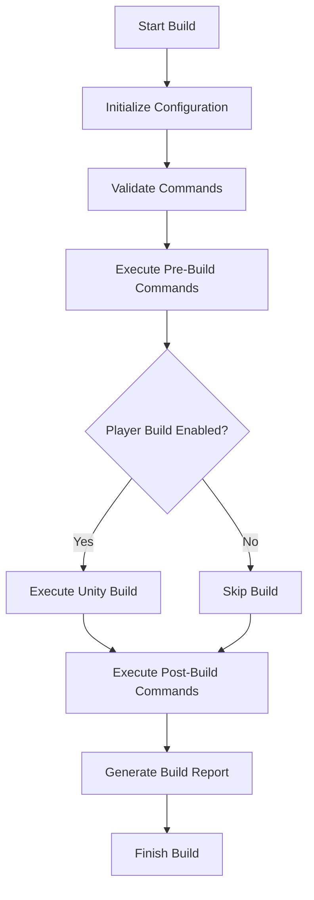

# UniGame.UniBuild

Command-based scriptable build pipeline for Unity Engine

- [UniGame.UniBuild](#unigameunibuild)
  - [Overview](#overview)
  - [Installation](#installation)
    - [Dependencies](#dependencies)
    - [Package Installation](#package-installation)
  - [Getting Started](#getting-started)
    - [Creating Build Configuration](#creating-build-configuration)
    - [Basic Usage](#basic-usage)
  - [Core Architecture](#core-architecture)
    - [Build System Components](#build-system-components)
    - [Build Pipeline Flow](#build-pipeline-flow)
    - [Configuration System](#configuration-system)
  - [Build Configuration](#build-configuration)
    - [Build Settings](#build-settings)
    - [Platform Configuration](#platform-configuration)
    - [Build Options](#build-options)
    - [WebGL Settings](#webgl-settings)
  - [Command System](#command-system)
    - [Command Types](#command-types)
    - [Creating Commands](#creating-commands)
      - [Serializable Command](#serializable-command)
      - [ScriptableObject Command](#scriptableobject-command)
    - [Built-in Commands](#built-in-commands)
      - [Platform Commands](#platform-commands)
      - [Build Configuration Commands](#build-configuration-commands)
      - [Utility Commands](#utility-commands)
      - [Asset Commands](#asset-commands)
    - [Command Execution](#command-execution)
  - [Build Pipeline](#build-pipeline)
    - [Pre-Build Commands](#pre-build-commands)
    - [Build Process](#build-process)
    - [Post-Build Commands](#post-build-commands)
    - [Build Validation](#build-validation)
  - [Console Arguments](#console-arguments)
    - [Built-in Arguments](#built-in-arguments)
      - [Build Configuration](#build-configuration-1)
      - [Platform Settings](#platform-settings)
      - [Development Options](#development-options)
      - [WebGL Options](#webgl-options)
    - [Custom Arguments](#custom-arguments)
    - [Arguments API](#arguments-api)
  - [Build Reporting](#build-reporting)
    - [Build Reports](#build-reports)
    - [Build Logger](#build-logger)
    - [Report Generation](#report-generation)
  - [Unity Cloud Build](#unity-cloud-build)
    - [Cloud Build Integration](#cloud-build-integration)
    - [Auto-Generated Methods](#auto-generated-methods)
  - [Advanced Features](#advanced-features)
    - [Build Validation](#build-validation-1)
    - [Command Groups](#command-groups)
    - [Build Environment Types](#build-environment-types)
    - [Editor Integration](#editor-integration)
  - [Examples](#examples)
    - [Basic Build Configuration](#basic-build-configuration)
    - [Custom Commands](#custom-commands)
    - [CI/CD Integration](#cicd-integration)
  - [Best Practices](#best-practices)
  - [Troubleshooting](#troubleshooting)
    - [Common Issues](#common-issues)
    - [Debug Tips](#debug-tips)

## Overview

UniGame.UniBuild is a comprehensive build automation system for Unity that provides:

- **Command-Based Architecture**: Modular build steps using command pattern
- **Scriptable Build Pipeline**: Visual configuration with ScriptableObjects
- **Multi-Platform Support**: Unified build system for all Unity platforms
- **Console Integration**: Full command-line interface for CI/CD systems
- **Unity Cloud Build**: Automatic integration with Unity Cloud Build
- **Extensible Commands**: Rich set of built-in commands and easy custom command creation
- **Build Reporting**: Comprehensive build reports and logging
- **Visual Editor**: Inspector-based configuration with Odin/Tri-Inspector support

## Installation

### Dependencies

**Odin Inspector or Tri-Inspector recommended for usage with this Package:**
- [Odin Inspector](https://odininspector.com)
- [Tri-Inspector](https://github.com/codewriter-packages/Tri-Inspector)

### Package Installation

Add to your project manifest by path `[%UnityProject%]/Packages/manifest.json`:

```json
{
  "dependencies": {
    "com.unigame.unibuildpipeline": "https://github.com/UnioGame/unigame.buildpipeline.git",
    "com.unigame.unicore": "https://github.com/UnioGame/unigame.core.git",
    "com.cysharp.unitask": "https://github.com/Cysharp/UniTask.git?path=src/UniTask/Assets/Plugins/UniTask"
  }
}
```

## Getting Started

### Creating Build Configuration

Create a new build configuration asset:


### Basic Usage

1. **Create Build Configuration**: Right-click in Project window → Create → UniBuild → UniBuildConfiguration
2. **Configure Settings**: Set build target, options, and commands
3. **Add Commands**: Configure pre-build and post-build commands
4. **Execute Build**: Use the build buttons or menu items

## Core Architecture

### Build System Components

The build system consists of several key components:

```csharp

// Build configuration interface
public interface IUniBuildCommandsMap : IUnityBuildCommandValidator, INamedItem
{
    bool PlayerBuildEnabled { get; }
    UniBuildConfigurationData BuildData { get; }
    IEnumerable<IUnityBuildCommand> PreBuildCommands { get; }
    IEnumerable<IUnityBuildCommand> PostBuildCommands { get; }
}

// Build command interface
public interface IUnityBuildCommand : IUnityBuildCommandValidator, IUnityBuildCommandInfo
{
    void Execute(IUniBuilderConfiguration configuration);
}
```

### Build Pipeline Flow



### Configuration System

Build configurations are managed through:

- **UniBuildCommandsMap**: Main configuration asset
- **UniBuildConfigurationData**: Build settings and parameters
- **BuildParameters**: Runtime build parameters
- **ArgumentsProvider**: Command-line arguments handling

## Build Configuration

### Build Settings

Configure basic build settings:

```csharp
[Serializable]
public class UniBuildConfigurationData
{
    public bool printBuildReport = true;
    public bool overrideArtifactName = true;
    public string artifactName = string.Empty;
    public bool overrideProductName = false;
    public string productName = string.Empty;
    
    public BuildTarget buildTarget;
    public BuildTargetGroup buildTargetGroup;
    public StandaloneBuildSubtarget standaloneBuildSubTarget;
    public ScriptingImplementation scriptingImplementation;
    public Il2CppCodeGeneration il2CppCodeGeneration;
    public Il2CppCompilerConfiguration cppCompilerConfiguration;
}
```

### Platform Configuration

Platform-specific settings:

```csharp
// Android settings
public class UniAndroidSettings
{
    public AndroidBuildType AndroidBuildType;
    public AndroidArchitecture AndroidArchitecture;
    public ApiCompatibilityLevel ApiCompatibilityLevel;
    public bool BuildAppBundle;
    public bool AllowDebugging;
    public ScriptingImplementation ScriptingBackend;
}

// iOS settings
public class UniiOSSettings
{
    public iOSTargetDevice TargetDevice;
    public iOSSdkVersion SdkVersion;
    public string TargetOSVersionString;
}
```

### Build Options

Configure Unity build options:

```csharp
public class BuildOptionsCommand : SerializableBuildCommand
{
    public bool setIncrementalIl2CppBuild = true;
    public BuildOptions[] buildOptions = { BuildOptions.None };
    
    public override void Execute(IUniBuilderConfiguration configuration)
    {
        var options = BuildOptions.None;
        foreach (var option in buildOptions)
            options |= option;
            
        configuration.BuildParameters.SetBuildOptions(options, false);
    }
}
```

### WebGL Settings

WebGL-specific configuration:

```csharp
[Serializable]
public class WebGlBuildData
{
    public bool ShowDiagnostics = false;
    public Vector2Int Resolution = new(1080, 1920);
    public int MaxMemorySize = 1024;
    public bool DataCaching = true;
    public WebGLExceptionSupport ExceptionSupport;
    public WebGLDebugSymbolMode DebugSymbolMode;
    public WebGLCompressionFormat CompressionFormat;
    public WebGLLinkerTarget LinkerTarget;
}
```

## Command System

### Command Types

UniBuild supports several command types:

1. **SerializableBuildCommand**: Inline serializable commands
2. **UnityBuildCommand**: ScriptableObject-based commands
3. **IUnityPreBuildCommand**: Pre-build execution commands
4. **IUnityPostBuildCommand**: Post-build execution commands

### Creating Commands

#### Serializable Command

```csharp
[Serializable]
public class CustomBuildCommand : SerializableBuildCommand
{
    public string customParameter = "default";
    public bool enableFeature = true;
    
    public override void Execute(IUniBuilderConfiguration configuration)
    {
        var arguments = configuration.Arguments;
        var buildParams = configuration.BuildParameters;
        
        // Custom build logic here
        Debug.Log($"Executing custom command with parameter: {customParameter}");
        
        // Access build arguments
        if (arguments.GetBoolValue("-customFlag", out bool flag))
        {
            Debug.Log($"Custom flag: {flag}");
        }
    }
}
```

#### ScriptableObject Command

```csharp
[CreateAssetMenu(menuName = "UniBuild/Commands/CustomCommand")]
public class CustomUnityCommand : UnityBuildCommand
{
    [SerializeField] private string targetPath = "Builds/";
    [SerializeField] private bool cleanBeforeBuild = true;
    
    public override void Execute(IUniBuilderConfiguration configuration)
    {
        if (cleanBeforeBuild)
        {
            // Clean target directory
            if (Directory.Exists(targetPath))
                Directory.Delete(targetPath, true);
        }
        
        // Custom command logic
        BuildLogger.Log($"Custom command executed for target: {targetPath}");
    }
}
```

### Built-in Commands

UniBuild includes many built-in commands:

#### Platform Commands
- **ApplyAndroidSettingsCommand**: Configure Android build settings
- **ApplyWebGLSettingsCommand**: Configure WebGL build settings
- **SwitchActiveBuildTargetCommand**: Change active build target

#### Build Configuration Commands
- **ApplyBuildArgumentsCommand**: Apply custom build arguments
- **BuildOptionsCommand**: Set Unity build options
- **SetScriptingBackendCommand**: Configure scripting backend
- **SetManagedStrippingLevelCommand**: Set code stripping level

#### Utility Commands
- **ApplyArtifactNameCommand**: Configure output artifact naming
- **ApplyLocationByArtifactCommand**: Set build output location
- **UpdateVersionCommand**: Update build version numbers
- **ApplyScriptingDefineSymbolsCommand**: Manage scripting defines

#### Asset Commands
- **ReimportAssetsCommand**: Reimport specified assets
- **DefineSymbolsAssetCommand**: Manage define symbols

### Command Execution

Commands are executed in order within command groups:

```csharp
public class BuildCommandStep
{
    public UnityBuildCommand buildCommand;
    public IUnityBuildCommand serializableCommand;
    
    public IEnumerable<IUnityBuildCommand> GetCommands()
    {
        if (buildCommand != null) yield return buildCommand;
        if (serializableCommand != null) yield return serializableCommand;
    }
}
```

## Build Pipeline

### Pre-Build Commands

Pre-build commands execute before the Unity build process:

```csharp
public interface IUnityPreBuildCommand : IUnityBuildCommand
{
    // Marker interface for pre-build commands
}
```

Common pre-build tasks:
- Setting up build environment
- Configuring player settings
- Preparing assets
- Validating build requirements

### Build Process

The core build process:

```csharp
public class UnityPlayerBuilder : IUnityPlayerBuilder
{
    public BuildReport Build(IUniBuilderConfiguration configuration)
    {
        BuildLogger.Initialize();
        
        // Apply build settings
        var buildParameters = configuration.BuildParameters;
        buildParameters.Execute();
        
        // Execute pre-build commands
        ExecuteCommands(commandsMap.PreBuildCommands, configuration);
        
        // Execute Unity build
        BuildReport report = null;
        if (commandsMap.PlayerBuildEnabled)
        {
            report = ExecuteBuild(configuration);
            configuration.BuildReport = report;
        }
        
        // Execute post-build commands
        ExecuteCommands(commandsMap.PostBuildCommands, configuration);
        
        return report;
    }
}
```

### Post-Build Commands

Post-build commands execute after the Unity build:

```csharp
public interface IUnityPostBuildCommand : IUnityBuildCommand
{
    // Marker interface for post-build commands
}
```

Common post-build tasks:
- Copying build artifacts
- Running tests
- Uploading to distribution platforms
- Generating reports

### Build Validation

Commands can implement validation logic:

```csharp
public interface IUnityBuildCommandValidator
{
    bool Validate(IUniBuilderConfiguration config);
}

public class PlatformSpecificCommand : SerializableBuildCommand
{
    public BuildTarget targetPlatform = BuildTarget.Android;
    
    public override bool Validate(IUniBuilderConfiguration config)
    {
        return config.BuildParameters.buildTarget == targetPlatform;
    }
}
```

## Console Arguments

### Built-in Arguments

UniBuild supports comprehensive command-line arguments:

#### Build Configuration
```bash
# Git branch
-gitBranch:develop

# Build options (Unity BuildOptions enum)
-buildOptions:Development,AutoRunPlayer,CleanBuildCache

# Bundle version
-bundleVersion:"1.0.0"

# Build number
-buildnumber:1000

# Output configuration
-outputFileName:MyGame.exe
-outputFolder:Builds

# Bundle ID
-bundleId:"com.company.game"
```

#### Platform Settings
```bash
# Build target
-buildTarget:Android

# Build target group
-buildTargetGroup:Android

# Scripting implementation
-scriptingImplementation:IL2CPP

# Standalone subtarget
-standaloneBuildSubtarget:Player
```

#### Development Options
```bash
# Development build
-developmentBuild

# Auto-connect profiler
-autoconnectProfiler

# Deep profiling
-deepProfiling

# Script debugging
-scriptDebugging
```

#### WebGL Options
```bash
# WebGL diagnostics
-webShowDiagnostics

# Compression format
-webCompressionFormat:Brotli

# Memory size
-webMemorySize:1024

# Data caching
-webDataCaching

# Code optimization
-webCodeOptimization:BuildTimes
```

### Custom Arguments

Create custom argument handling:

```csharp
[Serializable]
public class CustomArgumentsCommand : SerializableBuildCommand
{
    public string customIntArgument = "-customInt";
    public string customBoolArgument = "-customBool";
    public string customEnumArgument = "-customEnum";
    public int defaultIntValue = 100;
    
    public override void Execute(IUniBuilderConfiguration buildParameters)
    {
        var arguments = buildParameters.Arguments;
        
        // Get integer argument
        var intExists = arguments.GetIntValue(customIntArgument, out var intValue, defaultIntValue);
        
        // Get boolean argument
        var boolExists = arguments.GetBoolValue(customBoolArgument, out var boolValue, false);
        
        // Get enum argument
        var enumExists = arguments.GetEnumValue(customEnumArgument, out CustomEnum enumValue);
        
        // Set argument for other commands
        arguments.SetValue(customIntArgument, intValue.ToString());
        
        BuildLogger.Log($"Custom arguments - Int: {intValue}, Bool: {boolValue}, Enum: {enumValue}");
    }
    
    public enum CustomEnum
    {
        None,
        Option1,
        Option2
    }
}
```

### Arguments API

The arguments provider interface:

```csharp
public interface IArgumentsProvider
{
    List<string> SourceArguments { get; }
    IReadOnlyDictionary<string, string> Arguments { get; }
    
    string EvaluateValue(string expression);
    void SetArgument(string key, string value);
    string SetValue(string key, string value);
    
    bool GetIntValue(string name, out int result, int defaultValue = 0);
    bool GetBoolValue(string name, out bool result, bool defaultValue = false);
    bool Contains(string name);
    bool GetEnumValue<TEnum>(string parameterName, out TEnum result) where TEnum : struct;
    bool GetStringValue(string name, out string result, string defaultValue = "");
}
```

## Build Reporting

### Build Reports

UniBuild generates comprehensive build reports:

```csharp
public class BuildReportData
{
    public bool writeToFile = true;
    public bool writeLog = true;
    public BuildReport report;
}

public class UniBuildReportBuilder
{
    public void ApplyReport(BuildReportData reportData)
    {
        var report = reportData.report;
        if (report == null) return;
        
        PrintSummaryInfo(reportData, _reportBuilder);
        PrintStrippingInfo(reportData, _reportBuilder);
        PrintStepsInfo(reportData, _reportBuilder);
        PrintPackedInfo(reportData, _reportBuilder);
        
        var result = _reportBuilder.ToString();
        
        PrintToDebugLog(reportData, result);
        PrintToFile(reportData, result);
    }
}
```

### Build Logger

Centralized logging system:

```csharp
public static class BuildLogger
{
    public static void Initialize();
    public static void Log(string log);
    public static string LogWithTimeTrack(string log);
    public static void Log(string log, string trackId, bool resetTime = false);
    public static void Print();
    public static void Finish();
}

// Usage in commands
public override void Execute(IUniBuilderConfiguration configuration)
{
    var id = BuildLogger.LogWithTimeTrack("Starting custom operation");
    
    // Perform operation
    DoCustomOperation();
    
    BuildLogger.Log("Custom operation completed", id);
}
```

### Report Generation

Build reports include:

- **Build Summary**: Result, duration, output path, size
- **Build Steps**: Detailed step-by-step execution log
- **Asset Information**: Used assets, sizes, dependencies
- **Error/Warning Summary**: Build issues and messages
- **Performance Metrics**: Build times and resource usage

## Unity Cloud Build

### Cloud Build Integration

UniBuild automatically generates Cloud Build methods:


Auto-generated content is stored in: `Assets/UniGame.Generated/UniBuild/Editor`

### Auto-Generated Methods

Cloud Build helper methods:

```csharp
public static class CloudBuildHelper
{
    public static void PreExportCONFIG_NAME()
    {
        // Pre-export setup
        var configuration = CreateCommandParameters();
        var commandsMap = LoadBuildConfiguration();
        
        // Execute pre-build commands
        var preBuildCommands = commandsMap.PreBuildCommands;
        preBuildCommands.ExecuteCommands();
    }
    
    public static void PostExportCONFIG_NAME(string exportPath)
    {
        // Post-export processing
        var configuration = CreateCommandParameters();
        var commandsMap = LoadBuildConfiguration();
        
        // Execute post-build commands
        var postBuildCommands = commandsMap.PostBuildCommands;
        postBuildCommands.ExecuteCommands();
    }
}
```

## Advanced Features

### Build Validation

Implement build validation:

```csharp
public class BuildValidator : SerializableBuildCommand
{
    public override bool Validate(IUniBuilderConfiguration config)
    {
        var buildParams = config.BuildParameters;
        
        // Validate build target
        if (buildParams.buildTarget == BuildTarget.NoTarget)
        {
            Debug.LogError("Invalid build target");
            return false;
        }
        
        // Validate output path
        if (string.IsNullOrEmpty(buildParams.outputFolder))
        {
            Debug.LogError("Output folder not specified");
            return false;
        }
        
        return true;
    }
}
```

### Command Groups

Group related commands:

```csharp
[CreateAssetMenu(menuName = "UniBuild/ScriptableCommandsGroup")]
public class ScriptableCommandsGroup : UnityBuildCommand, 
    IUnityPreBuildCommand, IUnityPostBuildCommand
{
    public ApplyBuildArgumentsCommand arguments = new();
    public BuildCommands commands = new();
    
    public override void Execute(IUniBuilderConfiguration configuration)
    {
        arguments.Execute(configuration);
        
        foreach (var command in commands.Commands)
        {
            if (command.IsActive)
                command.Execute(configuration);
        }
    }
}
```

### Build Environment Types

Support different build environments:

```csharp
public enum BuildEnvironmentType
{
    Custom,
    UnityCloudBuild
}

public class EnvironmentSpecificCommand : SerializableBuildCommand
{
    public BuildEnvironmentType targetEnvironment = BuildEnvironmentType.Custom;
    
    public override bool Validate(IUniBuilderConfiguration config)
    {
        return config.BuildParameters.environmentType == targetEnvironment;
    }
}
```

### Editor Integration

Menu generation and editor windows:


## Examples

### Basic Build Configuration

```csharp
// Create a simple Android build configuration
var buildConfig = CreateInstance<UniBuildCommandsMap>();
buildConfig.BuildData.buildTarget = BuildTarget.Android;
buildConfig.BuildData.buildTargetGroup = BuildTargetGroup.Android;
buildConfig.BuildData.artifactName = "MyGame.apk";

// Add pre-build commands
var androidSettings = new ApplyAndroidSettingsCommand();
androidSettings.androidSettings.BuildAppBundle = true;
buildConfig.preBuildCommands.Add(new BuildCommandStep
{
    serializableCommand = androidSettings
});

// Add post-build commands
var openDirectory = new OpenDirectoryCommand();
openDirectory.folderPath.Add("Builds/");
buildConfig.postBuildCommands.Add(new BuildCommandStep
{
    serializableCommand = openDirectory
});
```

### Custom Commands

```csharp
[Serializable]
public class DeployToServerCommand : SerializableBuildCommand
{
    public string serverUrl = "ftp://deploy.server.com";
    public string username = "deploy_user";
    public string buildPath = "Builds/";
    
    public override void Execute(IUniBuilderConfiguration configuration)
    {
        var buildReport = configuration.BuildReport;
        if (buildReport?.summary.result != BuildResult.Succeeded)
        {
            BuildLogger.Log("Build failed, skipping deployment");
            return;
        }
        
        var outputPath = buildReport.summary.outputPath;
        BuildLogger.Log($"Deploying build from: {outputPath}");
        
        // Upload logic here
        UploadToServer(outputPath, serverUrl, username);
        
        BuildLogger.Log("Deployment completed successfully");
    }
    
    private void UploadToServer(string localPath, string server, string user)
    {
        // Implementation for file upload
    }
}
```

### CI/CD Integration

```bash
#!/bin/bash
# Jenkins/GitHub Actions build script

# Unity build with UniBuild
Unity -batchmode -quit \
    -projectPath /path/to/project \
    -executeMethod UniGame.UniBuild.Editor.UniBuildTool.BuildUnityPlayer \
    -buildTarget Android \
    -bundleVersion "1.2.3" \
    -buildnumber $BUILD_NUMBER \
    -outputFolder "Builds" \
    -outputFileName "MyGame.apk" \
    -developmentBuild \
    -gitBranch $GIT_BRANCH
```

## Best Practices

1. **Modular Commands**: Keep commands focused on single responsibilities
2. **Validation**: Always implement proper validation in commands
3. **Error Handling**: Use try-catch blocks and proper error reporting
4. **Logging**: Use BuildLogger for consistent logging across commands
5. **Platform Abstraction**: Create platform-agnostic commands when possible
6. **Configuration Management**: Use ScriptableObject commands for reusable configurations
7. **Build Validation**: Validate build settings before starting the build process
8. **Clean Builds**: Implement proper cleanup in pre-build commands
9. **Version Management**: Automate version updates in build pipeline
10. **CI/CD Integration**: Design commands to work well with automated systems

## Troubleshooting

### Common Issues

1. **Build Configuration Not Found**
   - Ensure build configuration assets are properly created
   - Check that configurations match the target platform

2. **Command Execution Failures**
   - Verify command validation logic
   - Check command dependencies and prerequisites
   - Review BuildLogger output for detailed error information

3. **Unity Cloud Build Issues**
   - Regenerate cloud build methods after configuration changes
   - Verify cloud build method signatures match Unity requirements

4. **Platform-Specific Problems**
   - Ensure platform-specific settings are properly configured
   - Check Unity version compatibility with target platforms

5. **Performance Issues**
   - Review command execution order and dependencies
   - Optimize heavy operations in custom commands
   - Use async operations where appropriate

### Debug Tips

```csharp
// Enable verbose logging
BuildLogger.Log("Debug information", "DEBUG_ID");

// Check build configuration
public override bool Validate(IUniBuilderConfiguration config)
{
    Debug.Log($"Validating for target: {config.BuildParameters.buildTarget}");
    return base.Validate(config);
}

// Monitor command execution
public override void Execute(IUniBuilderConfiguration configuration)
{
    var stopwatch = System.Diagnostics.Stopwatch.StartNew();
    
    try
    {
        // Command logic
        DoWork();
    }
    catch (Exception ex)
    {
        BuildLogger.Log($"Command failed: {ex.Message}");
        throw;
    }
    finally
    {
        stopwatch.Stop();
        BuildLogger.Log($"Command completed in {stopwatch.ElapsedMilliseconds}ms");
    }
}
```

For additional commands and extended functionality, check out:
- [UniGame Build Commands](https://github.com/UnioGame/UnioGame.UniBuildCommands)

This package includes additional commands for:
- Addressable Asset System
- FTP operations
- Web requests
- File and folder operations
- Platform-specific utilities